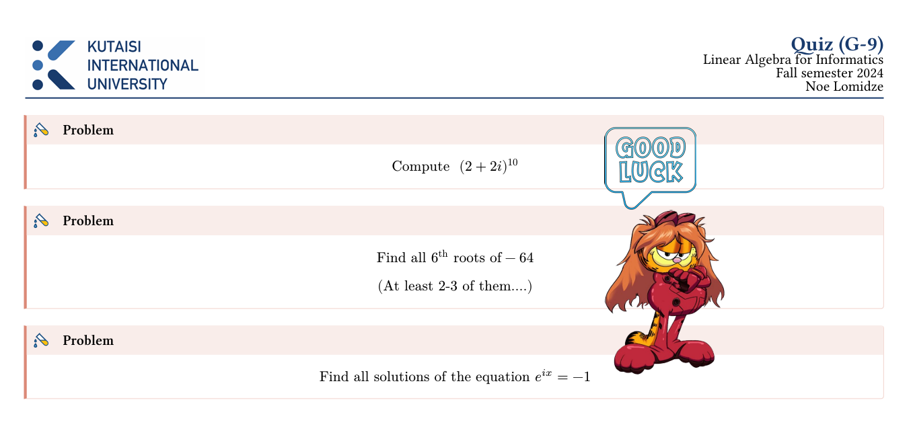

# Linear Algebra Quizzes for Informatics

## Overview
Quizzes and assessment materials developed during my teaching assistantship for the Linear Algebra course, tailored specifically for Informatics students.

## Course Focus
- Designed for students in Information Technology and Computer Science
- Covers fundamental linear algebra concepts with computational perspective

## Contents
- Quiz materials
- Problem sets
- Sample solutions

## Key Topics
- Linear Systems, matrices, vectors
- Matrix operations
- Linear transformations
- Vector spaces, span, basis linear independence
- Linear transformations and isomorphisms
- Eigenvalues, eigenvectors, eigenspaces
- Diagonalization, orthogonality
- Computational applications in Informatics

## Usage
Feel free to use these materials for learning, teaching, or reference in linear algebra courses.

### Example:

